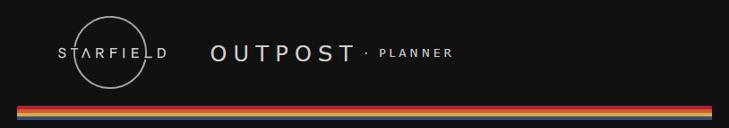

# Outpost

This is a community project for fans of the game [Starfield](https://bethesda.net/en/game/starfield). It is a tool to calculate the bill of materials needed for outpost construction, enhanced with the ability to selectively deconstruct higher tier components into their respective inputs.

[Live on https://outpost-delta.vercel.app/](https://outpost-delta.vercel.app/)

## Overview

- The app stores in the browser's local storage a list of construction projects.
- A catalog of available items to build mimics the game user experience, using the same structure, icons and names.
- When adding modules to construct, the app shows an Bill of Materials calculated for the selected modules and their number. The BoM differentiates between base materials and constructed components, as they are modeled in the game. Selecting for deconstruction a component breaks it down into its own inputs, adjusting the BoM accordingly.
- Projects can be created, renamed, deleted and duplicated.
- The current BoM can be copied to clipboard in a CSV format.
- A project can be copied to clipboard in its entirety - modules, deconstructed components selections - to be shared or transfered to other browsers.

## Project

Outpost is a [Next.js](https://nextjs.org) project bootstrapped with [`create-next-app`](https://nextjs.org/docs/app/api-reference/cli/create-next-app), developed with [TypeScript](https://www.typescriptlang.org/) and [React.js](https://react.dev/).

### Setup

#### Prerequisites

To run the project locally, you need to have installed [Git](https://git-scm.com/) and [Node.js](https://nodejs.org/). The default packae manager is `npm`, but the project works with alternatives such as `yarn` or `pnpm`.

#### Checkout and run

```
git clone https://github.com/stefan-rogin/outpost.git
cd outpost
npm install
# Start dev server, default on http://localhost:3000
npm run dev
```

See `package.json` for the full list of commands available for test, lint and format.

#### Test

The project contains both unit and integration tests run with plain [Jest](https://jestjs.io/), and `js-dom` tests with [React Testing Library](https://testing-library.com/) for components. By default, the render tests are not run. For the integration tests, there are mocks created for local storage and project data (resources).

```
# Run only unit and integration tests
npm run test
# Run only render tests
npm run test:render
# Run all tests
npm run test:all
```

#### Deploy

For CI/CD, Outpost uses a [Vercel](https://vercel.com/new?utm_medium=default-template&filter=next.js&utm_source=create-next-app&utm_campaign=create-next-app-readme) pipeline to build and serve the project, for both staging and production environments.

#### Project structure

```
outpost/
├── src/
│   ├── app/
│   │   ├── project-list/
│   │   │   └── page.tsx    // Projects list page
│   │   ├── layout.tsx
│   │   └── page.tsx        // Main (SPA) page
│   │
│   ├── components/
│   │   ├── catalog/
│   │   │   ├── CatalogPage.tsx          // Catalog category
│   │   │   └── CatalogView.tsx          // Catalog section
│   │   ├── common/
│   │   │   ├── Arrow.tsx                // Navigation arrows
│   │   │   └── Link.tsx                 // Navigation link
│   │   ├── project/
│   │   │   ├── BoM.tsx                  // Bill of materials
│   │   │   ├── OrderItemView.tsx        // Construction module
│   │   │   ├── Power.tsx                // Power required/generated
│   │   │   └── ProjectView.tsx          // Project section
│   │   ├── project-list/
│   │   │   ├── ProjectList.tsx          // List of stored projects
│   │   │   └── RecentProjects.tsx       // List of recently opened projects
│   │   ├── Intro.tsx                    // Intro content (help|error)
│   │   ├── Outpost.tsx                  // Main app component
│   │   └── PageFrame.tsx                // Page frame (shared)
│   │
│   ├── hooks/
│   │   └── useProject.ts                // Custom hook for project loading
│   │
│   ├── lib/
│   │   └── resources/                   // Creators kit exports and parser
│   │       ├── parse_export.ts
│   │       └── resources.json
│   │
│   ├── models/                          // App models
│   │   ├── bom.ts
│   │   ├── catalog.ts
│   │   ├── order.ts
│   │   ├── project.ts
│   │   └── resource.ts
│   │
│   ├── reducers/
│   │   └── projectReducer.ts            // App state reducer
│   │
│   ├── service/                         // Service layer
│   │   ├── bom.ts
│   │   ├── catalog.ts
│   │   ├── navigation.ts
│   │   ├── order.ts
│   │   ├── project.ts
│   │   └── resource.ts
│   └── types/
│        └── common.ts
│
├── tests/                               // Render | unit | integration tests
│   ├── components/
│   │   └── ....render.test.tsx
│   ├── mocks/
│   │   └── localStorageMock.ts
│   ├── reducers/
│   │   └── projectReducer.test.tsx
│   └── service/
│       └── ....test.tsx
│
├── ...
├── tsconfig.json
└── package.json
```

### Project data

The project runs without any external dependecies. Its configuration data (resources, blueprints) was obtained from the game itself, using [Starfield: Creation Kit](https://store.steampowered.com/app/2722710/Starfield_Creation_Kit/). Renderings of the modules, for the catalog icons, were obtained with the assistance of the same tool. The exported data is then parsed and prepared for the application by `/src/lib/resources/parse_export.ts`.

## Remarks

- With the runtime requiring broswer dependedncies only, CSR is virtually not used and most components are rendered client-side.
- All images, names, and intellectual property related to Starfield and its in-game items are the property of Bethesda Softworks and its respective owners. This tool is a fan-created resource and is not affiliated with, endorsed by, or associated with Bethesda. Data and renderings of modules were obtained using Starfield: Creation Kit.
